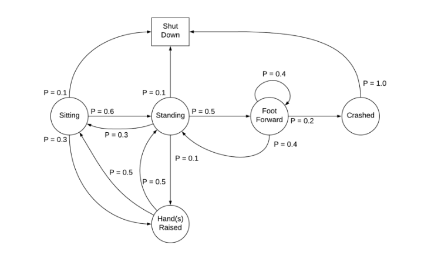

Quá trình quyết định Markov (Markov Decision Process - MDP) là một công cụ Toán học cho phép mô hình hóa quá trình ra quyết định (decision process), trong đó kết quả đầu ra có phần ngẫu nhiên (partly random) và có thể kiểm soát được (controllable). Hầu hết các bài toán trong lĩnh vực học tăng cường (reinforcement learning) đều có thể giải quyết bằng công cụ này.

## Một số thuật ngữ

| Khái niệm  	|   Ý nghĩa	|
|---	|---	|
|  Tác tử (Agent) 	|  Một tác tử (Một tác tử thông minh/ tác tử học tăng cường) là một thực thể mà chúng ta huấn luyện để mà giúp nó có thể đưa ra quyết định đúng đắn. Ví dụ: Một con robot được huấn luyến để có thể dịch chuyển một ly nước sao cho không làm đổ nước xuống sàn. |
|  Môi trường (Environment) |  Môi trường là tất cả những gì xung quanh tác tử mà nó có thể tương tác được. Ví dụ: căn phòng mà con robot có thể di chuyển trong đó. Tác tử không thể điều chỉnh/ thay đổi môi trường, mà nó chỉ có thể đưa ra các hành động/ kiểm soát hành động dựa trên sự thay đổi của môi trường xung quanh nó.	|
|  Trạng thái (State) 	|  Trạng thái (state) được định nghĩa là tình trạng hiện tại của tác tử tại một thời điểm nhất định. Trạng thái phụ thuộc vào bài toán mà chúng ta đang xem xét. 	|
|  Hành động (Action) 	|  Hành động (action) là sự lựa chọn của tác tử mà tạo ra trạng thái (state) hiện tại cho nó.	|
|  Chính sách (Policy) 	|  Một chính sách là quá trình suy nghĩ đằng sau việc chọn một hành động. Trong thực tế, đó là phân phối xác suất được gán cho tập hợp các hành động. Các hành động được khen thưởng cao sẽ có xác suất cao và ngược lại. Nếu một hành động có xác suất thấp, điều đó không có nghĩa là nó sẽ không được chọn. Nó chỉ ít có khả năng được chọn hơn. 	|

## Thuộc tính Markov

Một quá trình ngẫu nhiên (stochastic process) có thuộc tính Markov nếu phân phối xác suất có điều kiện (conditional probability distribution) của các trạng thái tương lai của quá trình chỉ phụ thuộc vào trạng thái hiện tại, nói cách khác, cho trước trạng thái hiện tại, trạng thái tương lai không phụ thuộc vào quá khứ. Một quá trình với thuộc tính như thế gọi là Markov hay Markovian hay quá trình Markov.

**Định nghĩa Toán học**: Gọi $$(\Omega, \mathcal{F}, \mathcal{P})$$ là không gian xác suất với một filtration $$(\mathcal{F}_s, s \in I)$$ (filtration là tập hợp các tập hợp con được sắp xếp hoàn toàn được sử dụng để mô hình hóa thông tin có sẵn tại một điểm nhất định) tập chỉ số $$I$$; và gọi $$(S, S)$$ là không gian khả độ đo (đo được - measurable space). Một quá trình ngẫu nhiên có giá trị trong $$(S, S)$$ $$X = {X_t : \Omega \rightarrow S}_{t\in I}$$ tương thích bộ lọc được gọi là một thuộc tính Markov nếu, với mỗi $$A \in S$$ và $$s, t \in I$$ mà $$s < t$$

$$
P(X_t \in A | \mathcal{F}_s) = P(X_t \in A | X_s)
$$

Trong bài toán học tăng cường, gọi trạng thái tại thời điểm $$t$$ là $$S_t$$. Ta nói một trạng thái $$S_t$$ là một Markov nếu và chỉ nếu

$$
\mathbb{P}(S_{t+1} | S_t) = \mathbb{P}[S_{t+1} | S_1, S_2, ..., S_t]
$$

Tức là, xác suất của trạng thái kế tiếp $$S_{t+1}$$ chỉ nên phụ thuộc vào trạng thái hiện tại $$S_t$$ và không phụ thuộc vào các trạng thái quá khứ.

## Quá trình Markov

Một quá trình Markov được định nghĩa bởi $$(S, \mathbb{P})$$, trong đó $$S$$ là trạng thái, $$\mathbb{P}$$ là xác suất dịch chuyển trạng thái. Quá trình Markov là một chuỗi các trạng thái ngẫu nhiên, mà trong đó mỗi trạng thái tuân theo thuộc tính Markov.

Xác suất dịch chuyển trạng thái $$\mathcal{P}_{ss'}$$ là xác suất dịch chuyển từ trạng thái $$s$$ sang trạng thái $$s'$$

$$
\mathcal{P}_{ss'} = \mathbb{P}[S_{t+1} = s' | S_t = s]
$$

Ví dụ:

## Quá trình phần thưởng Markov (Markov Reward Process - MRP)

## Quá trình ra quyết định Markov (Markov Decision Process - MDP)

## Áp dụng quá trình ra quyết định Markov vào bài toán học tăng cường

## Hàm giá trị tối ưu quá trình quyết định Markov

