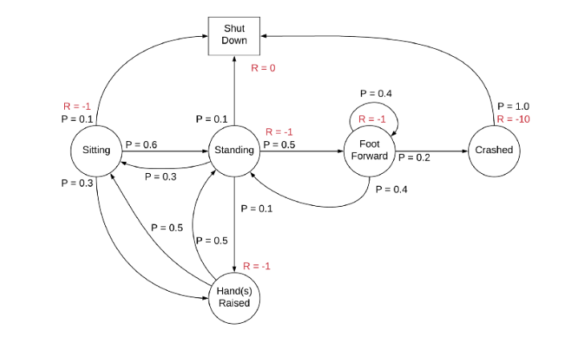

Quá trình quyết định Markov (Markov Decision Process - MDP) là một công cụ Toán học cho phép mô hình hóa quá trình ra quyết định (decision process), trong đó kết quả đầu ra có phần ngẫu nhiên (partly random) và có thể kiểm soát được (controllable). Hầu hết các bài toán trong lĩnh vực học tăng cường (reinforcement learning) đều có thể giải quyết bằng công cụ này.

## Một số thuật ngữ

| Khái niệm  	|   Ý nghĩa	|
|---	|---	|
|  Tác tử (Agent) 	|  Một tác tử (Một tác tử thông minh/ tác tử học tăng cường) là một thực thể mà chúng ta huấn luyện để mà giúp nó có thể đưa ra quyết định đúng đắn. Ví dụ: Một con robot được huấn luyến để có thể dịch chuyển một ly nước sao cho không làm đổ nước xuống sàn. |
|  Môi trường (Environment) |  Môi trường là tất cả những gì xung quanh tác tử mà nó có thể tương tác được. Ví dụ: căn phòng mà con robot có thể di chuyển trong đó. Tác tử không thể điều chỉnh/ thay đổi môi trường, mà nó chỉ có thể đưa ra các hành động/ kiểm soát hành động dựa trên sự thay đổi của môi trường xung quanh nó.	|
|  Trạng thái (State) 	|  Trạng thái (state) được định nghĩa là tình trạng hiện tại của tác tử tại một thời điểm nhất định. Trạng thái phụ thuộc vào bài toán mà chúng ta đang xem xét. 	|
|  Hành động (Action) 	|  Hành động (action) là sự lựa chọn của tác tử mà tạo ra trạng thái (state) hiện tại cho nó.	|
|  Chính sách (Policy) 	|  Một chính sách là quá trình suy nghĩ đằng sau việc chọn một hành động. Trong thực tế, đó là phân phối xác suất được gán cho tập hợp các hành động. Các hành động được khen thưởng cao sẽ có xác suất cao và ngược lại. Nếu một hành động có xác suất thấp, điều đó không có nghĩa là nó sẽ không được chọn. Nó chỉ ít có khả năng được chọn hơn. 	|

## Thuộc tính Markov

Một quá trình ngẫu nhiên (stochastic process) có thuộc tính Markov nếu phân phối xác suất có điều kiện (conditional probability distribution) của các trạng thái tương lai của quá trình chỉ phụ thuộc vào trạng thái hiện tại, nói cách khác, cho trước trạng thái hiện tại, trạng thái tương lai không phụ thuộc vào quá khứ. Một quá trình với thuộc tính như thế gọi là Markov hay Markovian hay quá trình Markov.

**Định nghĩa Toán học**: Gọi $$(\Omega, \mathcal{F}, \mathcal{P})$$ là không gian xác suất với một filtration $$(\mathcal{F}_s, s \in I)$$ (filtration là tập hợp các tập hợp con được sắp xếp hoàn toàn được sử dụng để mô hình hóa thông tin có sẵn tại một điểm nhất định) tập chỉ số $$I$$; và gọi $$(S, S)$$ là không gian khả độ đo (đo được - measurable space). Một quá trình ngẫu nhiên có giá trị trong $$(S, S)$$ $$X = {X_t : \Omega \rightarrow S}_{t\in I}$$ tương thích bộ lọc được gọi là một thuộc tính Markov nếu, với mỗi $$A \in S$$ và $$s, t \in I$$ mà $$s < t$$

$$
P(X_t \in A | \mathcal{F}_s) = P(X_t \in A | X_s)
$$

Trong bài toán học tăng cường, gọi trạng thái tại thời điểm $$t$$ là $$S_t$$. Ta nói một trạng thái $$S_t$$ là một Markov nếu và chỉ nếu

$$
\mathbb{P}(S_{t+1} | S_t) = \mathbb{P}[S_{t+1} | S_1, S_2, ..., S_t]
$$

Tức là, xác suất của trạng thái kế tiếp $$S_{t+1}$$ chỉ nên phụ thuộc vào trạng thái hiện tại $$S_t$$ và không phụ thuộc vào các trạng thái quá khứ.

## Quá trình Markov

Một quá trình Markov được định nghĩa bởi $$(S, \mathbb{P})$$, trong đó $$S$$ là trạng thái, $$\mathbb{P}$$ là xác suất dịch chuyển trạng thái. Quá trình Markov là một chuỗi các trạng thái ngẫu nhiên, mà trong đó mỗi trạng thái tuân theo thuộc tính Markov.

Xác suất dịch chuyển trạng thái $$\mathcal{P}_{ss'}$$ là xác suất dịch chuyển từ trạng thái $$s$$ sang trạng thái $$s'$$

$$
\mathcal{P}_{ss'} = \mathbb{P}[S_{t+1} = s' | S_t = s]
$$

Ví dụ:

## Quá trình phần thưởng Markov (Markov Reward Process - MRP)

Quá trình phần thưởng Markov (Markov Reward Process - MRP) được định nghĩa bởi $$(S, \mathbb{P}, \mathcal{R}, \gamma)$$, trong đó $$S$$ là trạng thái, $$\mathbb{P}$$ là xác suất dịch chuyển trạng thái, $$\mathcal{R}_s$$ là phần thưởng tại trạng thái $$s$$, và $$\gamma$$ là hệ số chiết khấu (discount factor).

$$
\mathcal{P}_{ss'} = \mathbb{P}[S_{t+1} = s' | S_t = s]
$$

$$
\mathcal{R}_s = \mathbb{E}[R_{t+1} |  S_t = s]
$$

Phần thưởng trạng thái (state reward) $$\mathcal{R}_s$$ được kỳ vọng (expected) trên tất cả các trạng thái khả thi (possible states) mà ta có thể dịch chuyển từ trạng thái $$s$$. Ta nói phần thưởng (reward) được nhận sau khi tác tử chuyển trạng thái, và được gọi là $$R_{t+1}$$.

Ví dụ:

## Quá trình ra quyết định Markov (Markov Decision Process - MDP)

Một quá trình ra quyết định (quyết định) Markov (Markov Decision Process - MDP) được định nghĩa bởi $$(S, A, \mathbb{P}, \mathcal{R}, \gamma)$$, trong đó A là tập hợp các hành động (action), $$S$$ là trạng thái, $$\mathbb{P}$$ là xác suất dịch chuyển trạng thái, $$\mathcal{R}_s$$ là phần thưởng tại trạng thái $$s$$, và $$\gamma$$ là hệ số chiết khấu (discount factor).

$$
\mathcal{P}_{ss'}^{a} = \mathbb{P}[S_{t+1} = s' | S_t = s, A_t = a]
$$

$$
\mathcal{R}_s^{a} = \mathbb{E}[R_{t+1} |  S_t = s, A_t = a]
$$

Dựa trên công thức, ta có thể thấy bản chất của quá trình ra quyết định (quyết định) Markov là một dạng quá trình phần thưởng Markov với các hành động. Trong các mô hình trước, xác suất dịch chuyển trạng thái (state transition probability) và các phần thưởng trạng thái (state rewards) nhiều hoặc ít tính ngẫu nhiên (stochastic/ random). Tuy nhiên, trong quá trình quyết định Markov, trạng thái kế tiếp phụ thuộc vào hành động mà tác tử lựa chọn (tác tử có khả năng kiểm soát hoàn toàn "vận mênh" của chính nó).

## Áp dụng quá trình ra quyết định Markov vào bài toán học tăng cường

### Trả về chiết khấu

Phần thưởng chỉ là giá trị tạm thời (temporary). Cho dù một hành động nào đó cho ra một phần thưởng xứng đáng (descent reward), chúng ta vẫn có thể mất một tổng phần thưởng lớn trong một quá trình dài. Thay vì trả về tổng phần thưởng (total rewards), người ta xem xét việc trả về chiết khấu. Trả về $$G_t$$ là tổng phần thưởng chiết khấu từ một bước đi thời điểm (time-step) $$t$$.

$$
G_t = R_{t+1} + \gamma R_{t+2} + ... = \sum_{k = 0}^{\infty}\gamma^kR_{t+k+1}
$$

### Giá trị chiết khấu $$\gamma$$

Giá trị của biến chiết khấu $$\gamma \in [0, 1]$$. Ý tưởng (Động lực đằng sau - intuition) của việc sử dụng một giá trị chiết khấu (discount) là KHÔNG có tính chắc chắn (certainty) về phần thưởng tương lai. Trong khi việc xem xét phần thưởng là rất quan trong cho việc trả về (Return), nó cũng quan trọng tương đương với việc giới hạn đóng góp của phần thương tương lai vào việc trả về (Return)

### Về chính sách (policy $$\pi$$)

Một chính sách $$\pi$$ là một phân phối trên các trạng thái hành động cho trước

$$
\pi(a | s) = \mathbb{P}[A_t = a | S_t = s]
$$

Một chính sách định nghĩa ý nghĩ đằng sau một quyết định (xác định một hành động tiếp theo). Yếu tố này tạo thành yếu tố hành vi cho tác tử học tăng cường.

### Hàm giá trị (value functions)

Một hàm giá trị (value functions) là một giá trị dài hạn của một trạng thái hay một hành động. Nói một cách khác, nó là kỳ vọng trả về dựa trên một trạng thái hay một hành động.

#### Hàm giá trị trạng thái cho MRP

Hàm giá trị trạng thái $$v(s)$$ là kỳ vọng của trả về bắt đầu từ một trạng thái $$s$$

$$
v(s) = \mathbb{E}[G_t | S_t = s]
$$

#### Biểu thức kỳ vọng Bellman cho MRP

Biểu thức Bellman cho ta một biểu diễn chuẩn cho hàm giá trị. Biểu thức này có thể được phân rã thành hai thành phần:
- Phần thưởng trực tiếp (immediate reward) $$R_{t+1}$$
- Giá trị chiết khấu của trạng thái tương lai $$\gamma v(S_{t+1})$$

$$
v(s) = \mathbb{E}[G_t | S_t = s]
$$

$$
= \mathbb{E}[R_{t+1} + \gamma R_{t+2} + \gamma^2 R_{t+3} + ... | S_t = s]
$$

$$
= \mathbb{E}[R_{t+1} + \gamma (R_{t+2} + \gamma R_{t+3}) + ... | S_t = s]
$$

$$
= \mathbb{E}[R_{t+1} + \gamma G_{t+1} | S_t = s]
$$

$$
= \mathbb{E}[R_{t+1} + \gamma v(S_{t+1}) | S_t = s]
$$

*Chứng minh*:
$$\mathbb{E}[R_{t+1} + \gamma G_{t+1} | S_t = s] = \mathbb{E}[R_{t+1} + \gamma v(S_{t+1}) | S_t = s]$$

Theo định nghĩa,

$$
\mathbb{E}[v(S_{t+1}) | S_t = s] = \mathbb{E}[\mathbb{E}[G_{t+1} | S_{t+1}] | S_t = s]
$$

Theo lý thuyết, dựa trên luật của kỳ vọng được duyệt, tức là
$$\mathbb{E}[\mathbb{E}[X | Y] | Z] = \mathbb{E}[X|Z]$$, ta có:

$$
\mathbb{E}[\mathbb{E}[G_{t+1} | S_{t+1}] | S_t = s] = \mathbb{E}[G_{t+1} | S_t = s]
$$

Và bởi vì:

$$
\mathbb{E}[G_{t+1} | S_t = s] = \mathbb{E}[v(S_{t+1}) | S_t = s]
$$

Xem xét lại biểu thức  ban đầu

$$
v(s) = \mathbb{E}[R_{t+1} + \gamma G_{t+1} | S_t = s]
$$

Phân phối hóa kỳ vọng:

$$
v(s) = \mathbb{E}[R_{t+1} | S_t = s] + \mathbb{E}[\gamma G_{t+1} |  S_t = s]
$$

Mà $$\mathbb{E}[aX+b] = a\mathbb{E}[X] + b$$, do đó:

$$
v(s) = \mathbb{E}[R_{t+1} | S_t = s] + \gamma \mathbb{E}[G_{t+1} |  S_t = s]
$$

$$
= \mathbb{E}[R_{t+1} | S_t = s] + \gamma \mathbb{E}[v(S_{t+1}) |  S_t = s]
$$

$$
= \mathbb{E}[R_{t+1} + \gamma v(S_{t+1}) | S_t = s]
$$

**Hàm giá trị trạng thái cho quá trình quyết định Markov** tương tự với MRP, nhưng có một khác biệt nhỏ. Ta gọi hàm giá trị trạng thái (state-value function) $$v_{\pi}(s)$$ của một MDP là kỳ vọng trả về bắt đầu từ một trạng thái $$s$$, và theo sau đó bởi một chính sách (policy) $$\pi$$

$$
v_{\pi}(s) = \mathbb{E}[G_t | S_t = s]
$$

Quá trình quyết định Markov thêm vào tính kiểm soát (controllable) cho MRP bằng cách xem xét những hành động như một tham số cho dịch chuyển trạng thái. Và do đó, nó cần phải được đánh giá cùng với các trạng thái. Người ta định nghĩa hàm giá trị hành động (action-value function) mà cho phép chúng ta kỳ vọng trả về trên các hành động. **Hàm giá trị hành động (action-value function)** $$q_{\pi}(s, a)$$ là kỳ vọng trả về bắt đầu từ trạng thái $$s$$, thực hiện hành động $$a$$, và theo sau đó bởi một chính sách (policy) $$\pi$$

$$
q_{\pi}(s, a) = \mathbb{E}[G_t | S_t = s, A_t = a]
$$

**Biểu thức kỳ vọng Bellman cho quá trình quyết định Markov**

Ta có trạng thái để chuyển tiếp hành động, chúng ta lấy hành động được kỳ vọng trên tất cả các hành động.

$$
v_{\pi}(s) = \sum_{a \in \mathcal{A}}\pi(a | s)q_{\pi}(s, a)
$$

Và cũng như thế với hàm giá trị hành động

$$
q_{\pi}(s, a) = \mathcal{R}_s^a + \gamma\sum_{s' \in S}\mathcal{P}^{a}_{ss'}v_{\pi}(s')
$$

Như thế thì, hàm giá trị trạng thái trở thành:

$$
v_{\pi}(s) = \sum_{a \in \mathcal{A}}\pi(a | s)\left(\mathcal{R}_s^a + \gamma\sum_{s' \in S}\mathcal{P}^{a}_{ss'}v_{\pi}(s')\right)
$$

## Hàm giá trị tối ưu quá trình quyết định Markov

Nếu chúng ta nhận được giá trị cho tất cả các trạng thái/ hành động của một quá trình quyết định Markov cho tất cả các mẫu (patterns) có thể có mà có thể chọn, sau đó chúng ta có thể chọn chính sách một cách đơn giản với giá trị cao cho các trạng thái và hành động. Những biểu thức trên biểu diễn những thứ chính xác. Nếu ta nhận được $$q^{*}(s, a)$$, bài toán được giải quyết.

Ta có thể gán đơn giản xác suất 1 cho hành động làm cực đại giá trị cho hàm $$q^{*}$$ và 0 cho các hành động còn lại cho tất cả các trạng thái

$$
\pi_{*}(a | s) =
\begin{cases}
1 \text{ if } a = \text{argmax}_{a \in A}q_{*}(s, a)\\
0 \text{ otherwise}
\end{cases}
$$

**Biểu thức Bellman tối ưu**

$$
v_{*} = \text{max}_{a}q_{*}(s, a)
$$

$$
q_{*}(s, a) = \mathcal{R}_s^a + \gamma\sum_{s' \in S}\mathcal{P}_{ss'}^{a}v_{*}(s')
$$

**Các lời giải tối ưu** cho MDP:
- Value iteration
- Policy iteration
- SARSA
- Q-Learning