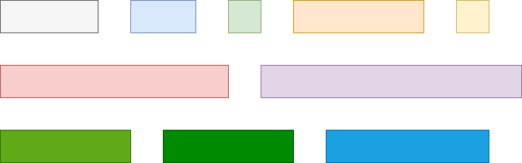

## A brief re-introduction about load balancing

This section will present about the original load balancing problems, preliminary with distributed scenarios and basic term of distributed models.

### Load balancing

First, we need to know about the original load balancing problem. Load balancing is a NP-hard problem:
- Input:
    - $$m$$  identical machines
    - $$n$$ jobs ($$n \geq m$$)
    - Job $$j$$ has processing time (size or length of the job) $$t_j$$
    - Job $$j$$ must run without interruption on a single machine.
    - A single machine can only process on job at a time

Let $$J(i)$$ be the subset of jobs assigned to machine $$i$$. The load of machine $$i$$ is $$L_i$$

$$
L_i = \sum_{j \in J(i)}t_j
$$

The goal here is assign every job to a machine so that maximum load (makespan) $$\text{max}\{L_1, ..., L_m\}$$ is minimized

### Example

We have some jobs

### With distributed scenarios

In distributed systems, which are a collection of identical computational machines, each machine has a number of initial tasks that must be processed. The goal here is to minimize the time necessary to accomplish all tasks in order to more efficiently use the computational power of the system. In other words, we expect to achieve uniform balance across all nodes (computational entities) in the networks. The challenge for those designing algorithms for distribution scenarios is the dynamic due to the appearance or disappearance of edges or nodes.

### Basic preliminary distributed models

Distributed models are include:
- Communication graph (computer network)
- Communication in the network
- Synchronous
- Dynamics
- Powerful computational entities
- Fault-free
- Unique

**Communication graph (computer network)**: is modeled by an undirected, connected graph. The nodes of this graph represent computational entities, and the edges represent bidirectional communication links.

**Communication in the network**: Entities in the network communicate via messsages. Each node can communicate with its neighbors in the communication network by sending messages to its neighbors (information propagation) and receiving messages from its neighbors (information aggregation).

**Synchronous**: Computation and communication in the network is synchronous. There is a clock that ticks continually and at each clock tick every node performs three steps:
- (A) Send message to each neighbor,
- (B) Receive a message from each neighbor,
- (C) Perform computation
When a clock is ticked, it completes a *round*.

**Dynamics**: Topology can change between communication graphs so that networks are dynamics (arbitrary edges changes but graph remains connected).

**Powerful computational entities**: At a certain time clock tick, no matter how difficult the computation may be, the computation step is compeleted instantly.

**Fault-free**: Nodes suffer no faults during the execution of the algorithm, and similarly, communication links suffer no faults.

**Unique**: Each node has a unique ID

Fault-free + message-passing + synchronous distributed model with unique IDs for each node = LOCAL model

CONGEST model = LOCAL model +  restricted size of message $$\theta(\text{log}n)$$

**Goal**: minimize the communication rounds

## Distributed load balancing

### Distributed load balancing - Fractional

Load in the system can be splitted indefinitely. So that, the perfect balancing always exists. However, it might be slow to converge.

### Distributed load balancing - Integral

There exists an atomic unit of load, i.e unit weights (e.g, 1). Example: if we have load equal 5, it cannot be splitted into 2.5 and 2.5, but splitted easily into 2 and 3. This case can always achieve 1-convergence. Model is more realistic than fractional case. However, it harder to get positive results.

## Related works

Related works on load balancing problem.

### Michael Dinitz, et al. [1]

Fractional load balancing: analyze how many rounds are required before the max neighbor strategy guarantees

$$
O\left(\text{min}\left\{n^2\text{log}\left(\frac{Tn}{\tau}\right)\text{log}n, \frac{Tn\text{log}n}{\tau}\right\}\right)
$$

Where $$T$$ is total load in the network; $$n$$ is number of nodes; $$\tau$$ is convergence parameter.
- Consider matching-based algorithms that node may exchange load with a single neighborhood.
- Lower bound for matching-based algorithms: $$\Omega(n^2)$$ and optimal upto *polylog factors*

### Yefim Dinitz et al. [2]

Static networks: analyze to give a convergence time

$$
O\left(nD\text{ln}\left(\frac{nT}{\tau}\right)\right)
$$

where $$D$$ is diameter of static networks.

Dynamic networks: faster convergence as long as any time step the diameter is bounded by some value $$D$$

Integral load balancing: only consider adjacent nodes must have similar loads. Due to adjacencies change frequently in dynamic settings => do not directly extend to dynamic settings.

## Research question

Focus on the time complexity of the load balancing in dynamic networks.

### RA1: What is the role of randomness in achieving a fast convergence time for the problem?

Considering the fractional load balancing, instead of having nodes flip a coin at every round to determine upon their role, paper shows that a node can play both role (send a request; consider request received). By “pretending” a node to be two nodes, one which only sends and one which only receives. Thus, the problem can be solved in deterministic. The system achieves $$\tau$$-convergence in time:

$$
O\left(\text{min}\left\{n^2\text{log}\left(\frac{Tn}{\tau}\right), \frac{Tn}{\tau}\right\}\right)
$$

Where $$T$$ is total load in the network; $$n$$ is number of nodes; $$\tau$$ is convergence parameter.

Note: improving the results of previous work by a $$\text{log}n$$ factor.

### RA2: Assuming integral loads, can a bounded convergence time still be achieved?

It is very natural to know that a **basic atomic** unit of load that *cannot be splited*. Constraints that all nodes are initially integers and must remain so throughout the balance process, thus making the problem harder. Some algorithms might shift loads that no need according to each node’s local view. However, it is hard to be done in general. For answering this research question, one theorem shown that no matching-based algorithm can achieve a
bounded convergence time for the integral case.

### RA3: Going beyond the worst-case analysis enables to achieve a bounded convergence time in integral case?

Motivation from smoothed analysis: fractional noise and adaptive adversary to make the problem can solved fast. Smoothed complexity: a deterministic, matching-based, load balancing algorithm, for any $$k>0$$ approximate number of random edges added per round:

$$
O\left(\frac{n^2}{k}\text{log}\frac{T}{\tau}\text{log}(n\text{log}T)\right)
$$

## References

[1] Dinitz, M., Fineman, J., Gilbert, S., & Newport, C. (2017, May). [Load balancing with bounded convergence in dynamic networks](https://ieeexplore.ieee.org/abstract/document/8057000/). In IEEE INFOCOM 2017-IEEE Conference on Computer Communications (pp. 1-9). IEEE.

[2] Dinitz, Y., Dolev, S., Kumar, M. (2020). [Brief Announcement: Local Deal-Agreement Based Monotonic Distributed Algorithms for Load Balancing in General Graphs](https://link.springer.com/chapter/10.1007/978-3-030-64348-5_9). In: Devismes, S., Mittal, N. (eds) Stabilization, Safety, and Security of Distributed Systems. SSS 2020. Lecture Notes in Computer Science(), vol 12514. Springer, Cham. https://doi.org/10.1007/978-3-030-64348-5_9

